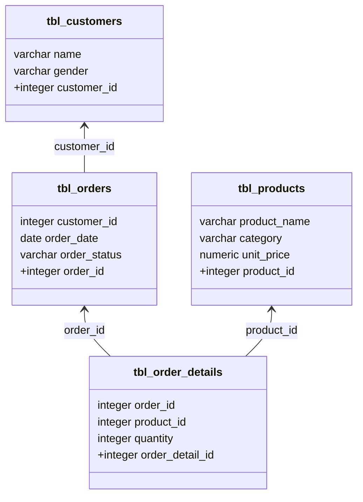

# magic-store-db

[](https://github.com/sorieux/magic-shop-db/actions/workflows/ci.yml)

A Dockerized PostgreSQL database for a fictitious magic shop inspired by the Harry Potter universe, pre-loaded with realistic sample data.

The goal is to provide a fun and easy-to-set-up data source for demonstrations, tests, or learning SQL. Feel free to share how you've made use of it!

## Schema



## Seed Data

| Table | Rows | Description |
|---|---|---|
| `tbl_customers` | 164 | Harry Potter characters |
| `tbl_products` | 71 | Magic items across 8 categories |
| `tbl_orders` | ~5 000 | Orders spanning 2021 |
| `tbl_order_details` | ~12 400 | Order line items |

## Available Views

Five views are pre-built so you can start querying immediately:

| View | Description |
|---|---|
| `vw_order_summary` | All orders with customer name, item count, and total amount |
| `vw_sales_by_product` | Revenue and quantity sold per product (completed orders) |
| `vw_sales_by_category` | Revenue and quantity sold per category (completed orders) |
| `vw_customer_stats` | Per-customer order counts and total spend |
| `vw_monthly_revenue` | Monthly revenue from completed orders |

```sql
-- Top 10 customers by spend
SELECT name, total_spent FROM vw_customer_stats LIMIT 10;

-- Best-selling categories
SELECT category, total_revenue FROM vw_sales_by_category;

-- Revenue per month
SELECT month, revenue FROM vw_monthly_revenue;
```

## Prerequisites

- Docker
- Docker Compose

## Setup & Running

```bash
git clone https://github.com/sorieux/magic-shop-db.git
cd magic-shop-db
chmod -R a+rx db/
docker compose up -d
```

The container exposes a healthcheck — the database is ready when `docker compose ps` shows `(healthy)`.

With Make:

```bash
make up    # start in background
make wait  # block until healthy
make psql  # open a psql session
make down  # stop
make reset # wipe data and restart
```


## Accessing the Database

| Field | Value |
|---|---|
| Host | `localhost` |
| Port | `5432` |
| User | `harry` |
| Password | `potter` |
| Database | `magic-shop` |

> **Note:** These credentials are for local development only. Do not use them in any shared or production environment.

## Testing

The project ships with an integration test suite (pytest + psycopg2) that verifies the schema, constraints, views, and referential integrity.

```bash
make test   # starts the DB if needed, then runs the full suite
```

Or manually:

```bash
uv sync --group test
uv run pytest tests/ -v
```

## SQL Linting

The schema file is linted with [sqlfluff](https://sqlfluff.com) (postgres dialect).

```bash
uv sync --group lint
uv run sqlfluff lint db/init/01_schema.sql
# or simply:
make lint
```

## Contributing

Fork the repository and use a feature branch. Pull requests are warmly welcome.
See [CHANGELOG.md](CHANGELOG.md) for the history of changes.
